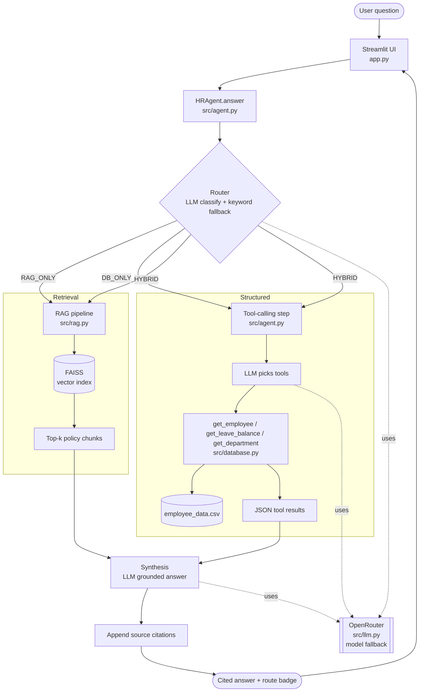

# Architecture — HRAssistant-Agent

A conversational HR copilot that answers questions from **unstructured policy
documents** (RAG over FAISS) and **structured employee records** (LLM
tool-calling), choosing the right source per question via a **hybrid router**.

---

## 1. High-level flow



---

## 2. Components

| Layer | File | Responsibility |
|---|---|---|
| **UI** | `app.py` | Streamlit chat, employee picker, document upload, source/route display. Caches embeddings, DB, and index with `@st.cache_resource`. |
| **Agent** | `src/agent.py` | `HRAgent`: routing → retrieval + tool-calling → synthesis → citations. |
| **LLM provider** | `src/llm.py` | OpenRouter (OpenAI-compatible) client. `chat()`, `chat_with_tools()`, multi-model fallback. |
| **RAG** | `src/rag.py` | Chunk → embed (local MiniLM) → FAISS index → top-k retrieve. |
| **Database + tools** | `src/database.py` | `EmployeeDB` (pandas/CSV) + tool JSON schema + executors. |
| **Config** | `config.py` | Env-driven settings; no Streamlit import at module load; no hardcoded secrets. |

---

## 3. Query routing

The router labels each question and only runs the data sources it needs:

| Example | Route | Sources used |
|---|---|---|
| "What is the maternity leave policy?" | `RAG_ONLY` | Policy docs |
| "What is E001's leave balance?" | `DB_ONLY` | Employee DB |
| "What's the maternity policy and how many leaves does E001 have left?" | `HYBRID` | Both |

Routing is **LLM-first** (a one-shot classifier prompt) with a **deterministic
keyword fallback** (`_keyword_route`) if the model call fails — so the app stays
functional even when a free model is rate-limited.

---

## 4. RAG pipeline

```
Document  →  Chunk  →  Embed  →  FAISS  →  Retrieve  →  LLM answer
(PDF        (recursive   (all-MiniLM   (in-memory   (top-k,
 upload)     splitter)    -L6-v2, CPU)   index)       k=4)
```

- Embeddings are generated **locally** — no embedding API key required.
- The index starts **empty**; users upload **PDF** policy documents in the
  sidebar to populate it. Policy (RAG) answers are unavailable until at least
  one document is indexed; employee-record answers work regardless.
- Retrieved chunks carry their `source` filename for citation.

---

## 5. Tool-calling pipeline

```
Query  →  LLM (tools available, tool_choice=required)  →  tool call(s)
       →  execute against employee_data.csv  →  JSON results  →  synthesis
```

Three tools are exposed to the model:

| Tool | Returns |
|---|---|
| `get_employee(name_or_id)` | Profile: department, role, manager, contact, joining date |
| `get_leave_balance(name_or_id)` | Casual / sick / earned / total leave |
| `get_department(department)` | Roster + headcount |

In `DB_ONLY` / `HYBRID` routes the model is asked to call at least one tool
(`tool_choice="required"`, with an `"auto"` retry for models that don't support
forced calls), so structured answers don't get hallucinated.

---

## 6. Answer synthesis & grounding

The final LLM call receives only the gathered context (policy excerpts +
tool results) plus the last few turns of chat history, and is instructed to
answer **only** from that context and to say so when information is missing.
Citations (`Policy documents: …` and/or `Employee database`) are appended in
code, not by the model.

---

## 7. Data flow summary

```
employee_data.csv ──► EmployeeDB ──► tools ──┐
                                             ├─► synthesis ─► cited answer
uploaded PDFs ──► chunk ──► FAISS ──► chunks┘
                              ▲
                     local MiniLM embeddings
```
